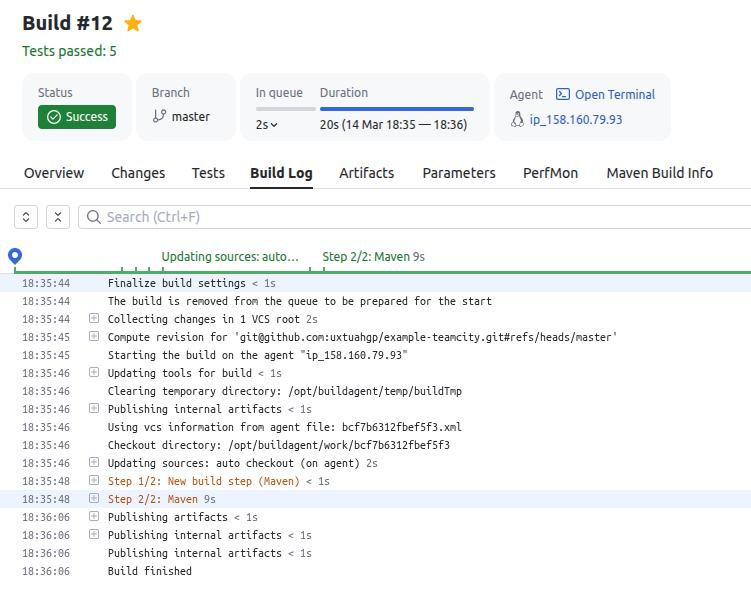
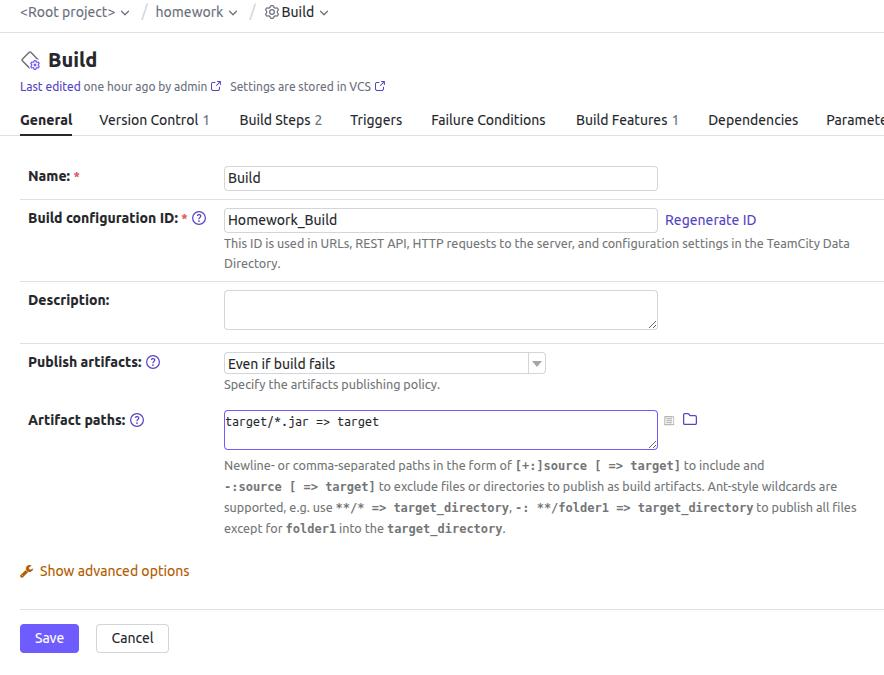

## Teamcity homework ##  
During pre tasks created VMs with dockerized services Teamcity server and Teamcity agent.  
Initialized new teamcity server.  
Authorized new agent in Tamecity server.  
Additionally created VM with Fedora 37 for Nexus and deployed nexus on it.  
Made a fork of given exaple project.  
### Steps 1-3 ###  
Created homework project.  
Autodetected config as Maven.  
Made first build for master.  
### Steps 4-7 ###  
Added condition for Build step for master and changed goals to clean deploy.  
  
Created copy of Build step. Changed golas to clean test and added condition to ignore master branch.     
  
Ran the Build steps and checked for changes in Nexus  
  
### Step 8 ###  
Configured build configuration export to github repo  
  
### Step 9 ###  
Added feature/add_replay 
### Steps 10-13 ###  
Added new method sayHunter  
Added test for replay with hunter  
Ran build successfully  
  
### Steps 14-15 ###  
Merged changes from add_replay to master  
Ran build successfully  
  
No artifacts after build  
### Step 16 ###  
Made changes to build configuration to create .jar  
  
### Step 17 ###  

